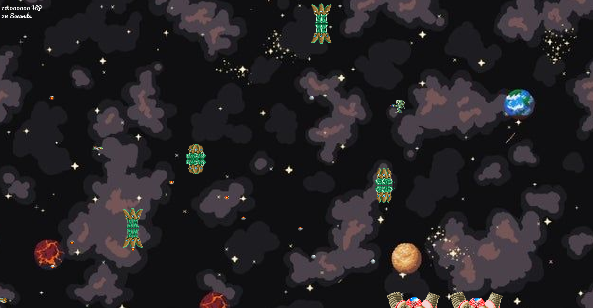
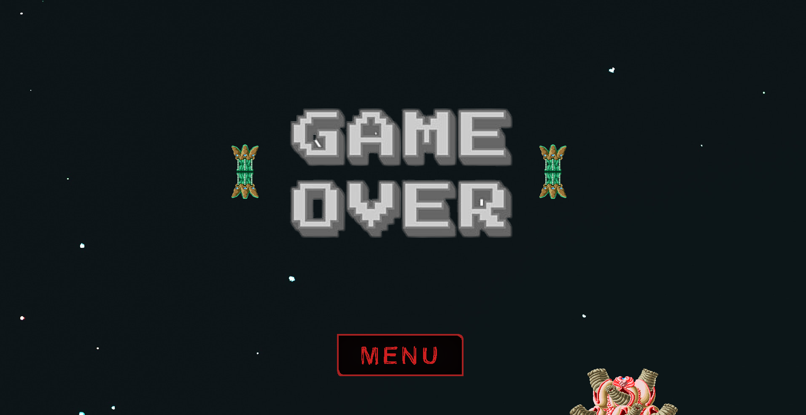

# Game - R-Type - README


## Description

R-Type is a classic shoot'em up game that has gained great popularity over the years. This game challenges you to pilot a spacecraft in a perpetually moving world, while facing waves of formidable enemies.

## Screenshots

### Game Scene


### Gameover Scene
You have died; you can return to the menu


## Features

- Control a spacecraft to combat alien enemies.
- Increasing difficulty levels to test your skills.
- Collect power-ups and upgrade your spacecraft to become more powerful.
- Epic bosses to defeat at the end of each level.
- Retro graphics and sound effects for a nostalgic experience.

## R-Type: Choose Your Character

In the R-Type game mode, players have the option to choose from three unique character types:

1. **Character A**: A well-rounded character with standard abilities.
2. **Character B**: A tanky character with slower movement and greater durability but reduced firepower.
3. **Character C**: A fast and powerful character with high damage output but lower health.


## Installation

1. Clone this repository to your local machine:
   ```bash
   git clone git@github.com:rtipe/RType.git

## Controls

- Use the arrow keys (up, down, left, right) to control the movement of your spacecraft.
- Press 'A' for a basic shot.
- Press 'Z' for a directional shot.
- Press 'R' for a powerful shot.
- Collect power-ups to upgrade your weapons and abilities.

## Build

1. Create a build directory at the root:
    ```bash
    mkdir build
    cd build

2. Compile in this directory:
    ```bash
    cmake ..
    cmake --build .

3. Go to the bin directory created by the compilation:
    ```bash
    cd bin

4. Execute the binary at the root of this repositry:
    ```bash
    ./RType

## Contributor

- abdelkader.mazouz@peitech.eu
- vincent.ballandi@epitech.eu
- younes1.bahri@epitech.eu
- swann.lagoute@epitech.eu
- simon.vermeulen@epitech.eu

## License

This project is licensed under the MIT License. See the [LICENSE](LICENSE) file for details.


## Disclaimer

If you are a student at Epitech, use the concepts used, not the code, or the cheat sheet will find you and give you a -42.

Enjoy playing R-Type! If you have any questions, issues, or suggestions, please submit them in the Issues section of this repository.
